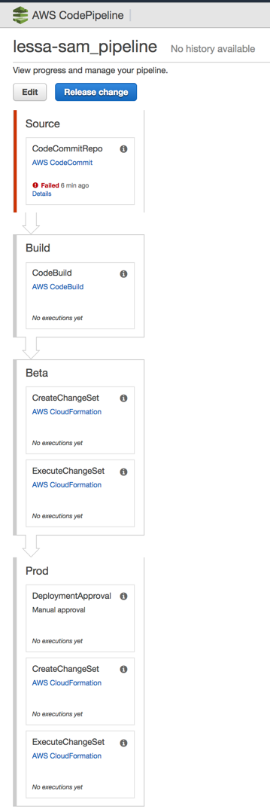

# Cookiecutter Pipeline for SAM based Python Lambda functions

A cookiecutter template to create a Pipeline for your Serverless App based on Serverless Application Model (SAM) and Python 3.6.

## Requirements

Install `cookiecutter` command line: `pip install cookiecutter` or `brew install cookiecutter` using Homebrew

## Usage

Generate a new SAM based Serverless App: `cookiecutter gh:heitorlessa/cookiecutter-aws-sam-python-pipeline` 

After generated you should have the following files:

```bash
<project-name>
├── README.md
├── buildspec.yaml          <-- CodeBuild spec
└── pipeline.yaml           <-- Cloudformation template to generate this pipeline
```

After the pipeline is deployed and created successfuly you should have a similar pipeline as follow:



**NOTE:** First step will fail because there is no source code yet in the Git repository created as part of the Cloudformation stack

# Credits

* This project has been generated with [Cookiecutter](https://github.com/audreyr/cookiecutter)

License
-------

This project is licensed under the terms of the [MIT License](/LICENSE)
